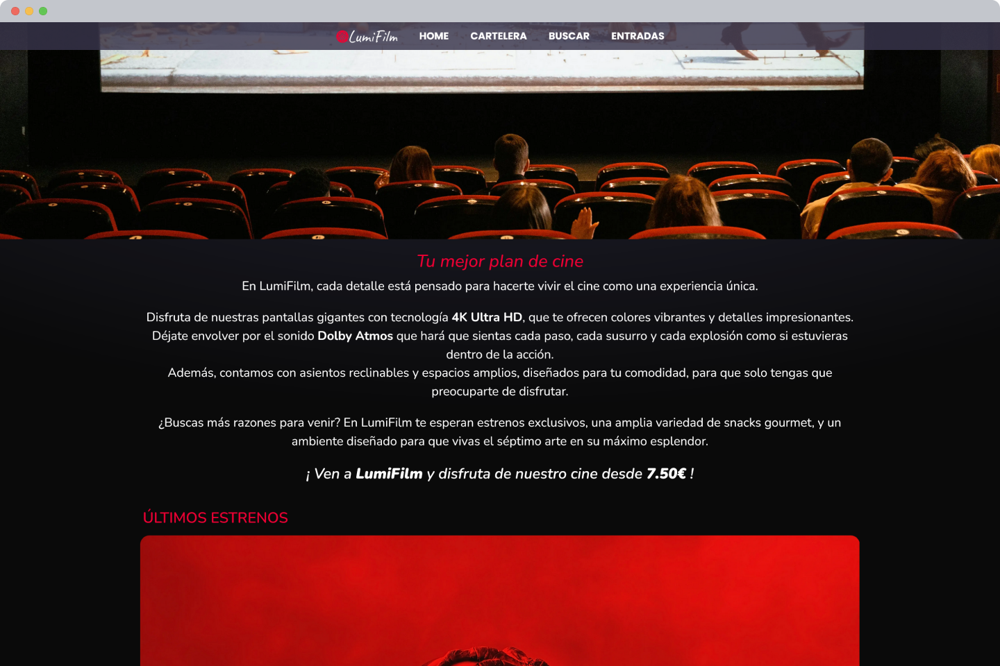
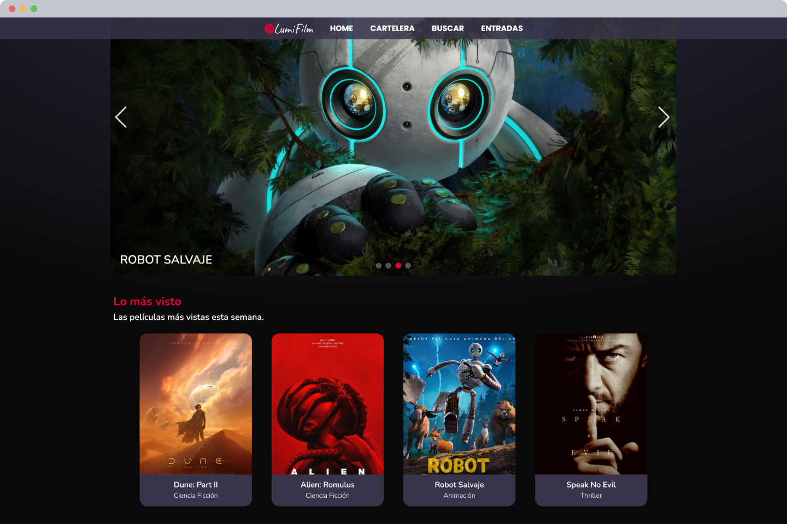

# 🎥 LumiFilm - Venta de Entradas de Cine

Bienvenido/a a **LumiFilm**, una plataforma moderna e intuitiva para comprar entradas de cine desde cualquier lugar. Descubre las últimas películas, próximos estrenos y disfruta de una experiencia de usuario única. 🌟

## 🚀 Objetivo del Proyecto

El objetivo es desarrollar una plataforma moderna y funcional para mejorar la forma en que los usuarios adquieren entradas de cine en línea. Este proyecto se centra en:

- **Facilidad de uso:** Experiencia de usuario intuitiva en todos los dispositivos.
- **Diseño elegante:** Interfaz basada en una guía de estilo cohesiva y profesional.
- **Enfoque Mobile First**: El diseño está optimizado para dispositivos móviles, garantizando accesibilidad desde cualquier pantalla.
- **Desarrollar el frontend:** consumiendo un backend mediante una **API REST**.
- **Desplegar:**  tanto localmente como en la nube.

Este repositorio corresponde **únicamente al frontend** del proyecto.

---

## 🚀 Funcionalidades

- 🏠 **Home**: Información sobre nuestro cine, carousel de últimos estrenos, apartado de películas más vistas y de próximos estrenos.
- 🎞️ **Cartelera**: Podrás ver todas las películas que hay actualmente en la cartelera.
- 🎟️ **Compra de entradas**: Selección rápida y sencilla de películas, horarios y asientos.
- 🌐 **Diseño Responsive**: Perfecto para dispositivos móviles, tablets y escritorio.

---

## 🛠️ Tecnologías y Herramientas Utilizadas

### Front-end:
- **HTML5** y **CSS3** (con preprocesador **SASS**).
- **JavaScript Vanilla** para la lógica del cliente.

### Herramientas:
- **Figma:** Para el diseño de prototipos interactivos.
- **Git y GitHub:** Para control de versiones con metodología **GitFlow**.
- **Gulp:** Para automatizar tareas como la compilación de SASS.
- **Docker**: Para contenerización y despliegue.

### Infraestructura:
- **AWS EC2**: 
  - Contenerización del **frontend** y **backend** utilizando Docker.

---

## 🖥️ Mockups del Proyecto

Aquí tienes una vista previa de cómo luce **LumiFilm**:

### Versión móvil


### Versión escritorio
<p align="center">
  
  
  
</p>

---

## 🛠️ Instalación y Configuración

Sigue estos pasos para iniciar el proyecto en tu máquina local:

### 1️⃣ Clonar el repositorio
```bash
    git clone https://github.com/pxtricixdev/Front-LumiFilm.git
```
    
### 2️⃣ Instalar las dependencias
```bash
    npm install
    npm install -g sass
    npm install -g gulp
```

### 3️⃣ Compilar el SCSS a CSS
 Para compilar los estilos, utiliza el siguiente comando:
```bash
    gulp compilar-sass
```
---

### 📂 Estructura del Proyecto

```plaintext

FRONT-LUMI/
├── .vscode/               # Configuración de VS Code
├── assets/                # Recursos estáticos como imágenes, íconos, etc.
├── dist/                  
│   └── style/
│       └── main.css       # Archivo CSS compilado
├── html/                  # Páginas HTML del proyecto
├── node_modules/          # Dependencias instaladas
├── scripts/               # Archivos JavaScript de toda la web
├── source/                # Archivos fuente SCSS
│   ├── base/              # Estilos base como resets y variables SCSS
│   ├── components/        # Componentes reutilizables (botones, modales, etc.)
│   ├── layout/            # Estilos de diseño general (header, footer, navbar, modal)
│   └── pages/             # Estilos específicos para las páginas
│   └── main.scss          # Archivo SCSS principal
├── .dockerignore          # Archivos y carpetas ignorados por Docker
├── .gitignore             # Archivos y carpetas ignorados por Git
├── Dockerfile             # Configuración de Docker
├── gulpfile.js            # Configuración de tareas automatizadas con Gulp
├── package-lock.json      # Dependencias específicas del proyecto
├── package.json           # Dependencias y scripts del proyecto
└── README.md              # Documentación del proyecto


